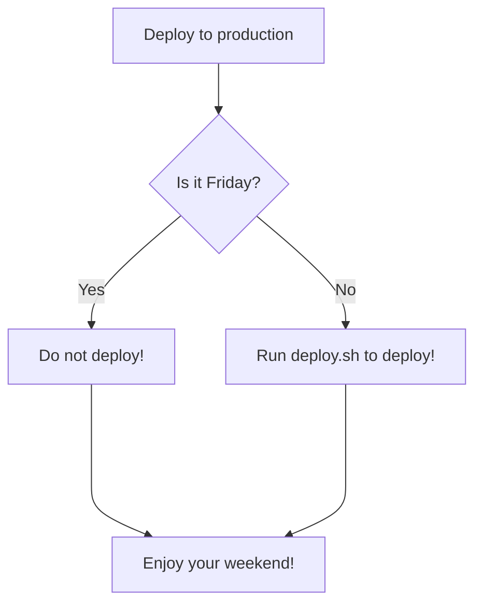
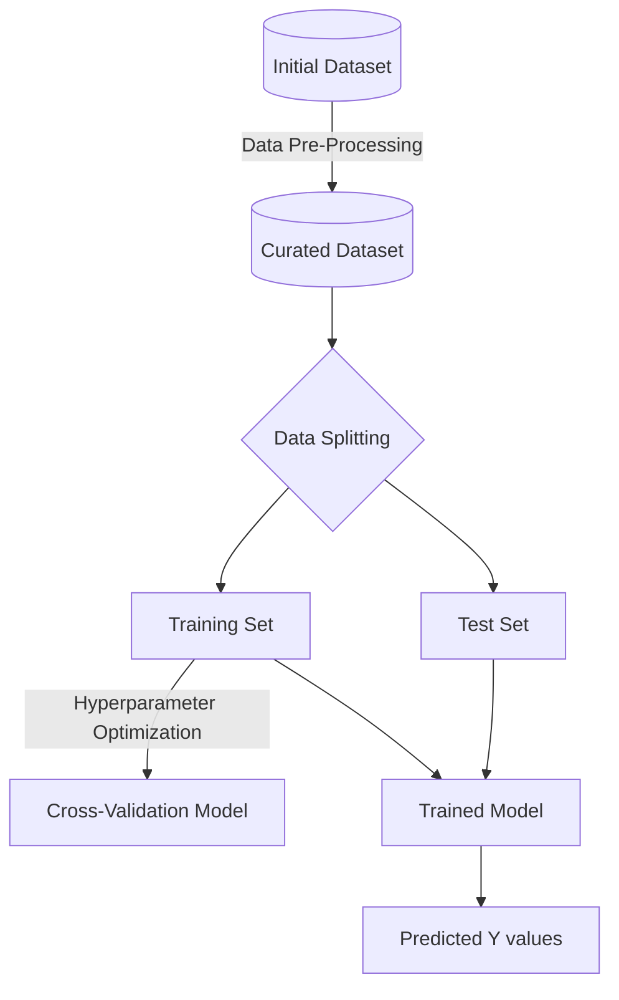

# mermaid

### What is mermaid?
`Mermaid` allows the creation of diagrams using Markdown syntax.

### Simple examples
Here's a simple example:

```markdown

```


The following is the output:


The diagram can be much more elaborate as well:



### Workflow example



### Reference
- Examples shown here are taken from: [Include diagrams in your Markdown files with Mermaid
](https://github.blog/2022-02-14-include-diagrams-markdown-files-mermaid/)
- [Mermaid Live Editor](https://mermaid-js.github.io/mermaid-live-editor/)
- [Mermaid Docs](https://mermaid-js.github.io/mermaid/#/)
