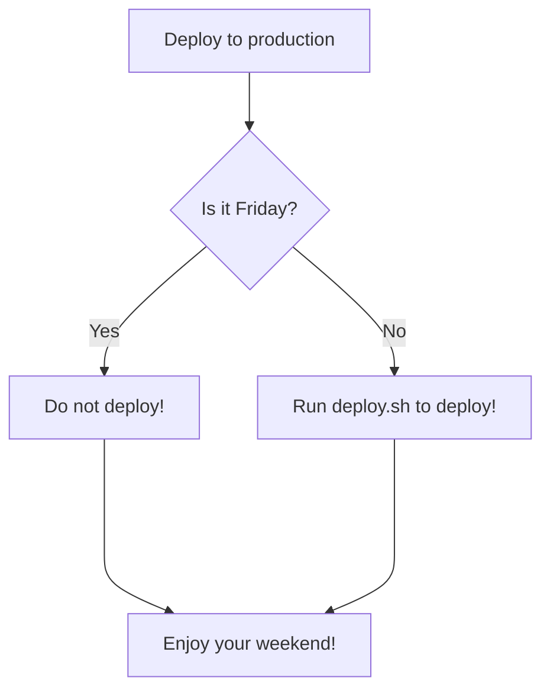

# mermaid

### What is mermaid?
`Mermaid` allows the creation of diagrams using Markdown syntax.

### Simple examples
Here's a simple example:


The diagram can be much more elaborate as well:



# Workflow example

```mermaid
flowchart TD
  A[Inital Dataset] --> B[Pre-Processed Dataset];
  B ----> C[Data Splitting];
  C ----> D[Training set];
  C -- --> E[Test set];
  D ----> F[Cross-Validation Model];
  D ----> G[Trained Model];
  E ----> G[Trained Model];
  G ----> H[Predicted Y values];
```

### Reference
Examples shown here are taken from:
- [Include diagrams in your Markdown files with Mermaid
](https://github.blog/2022-02-14-include-diagrams-markdown-files-mermaid/)
